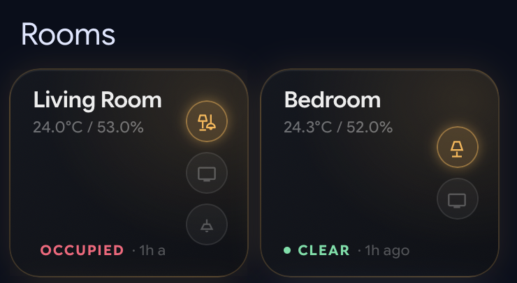
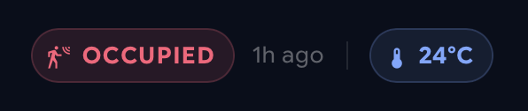
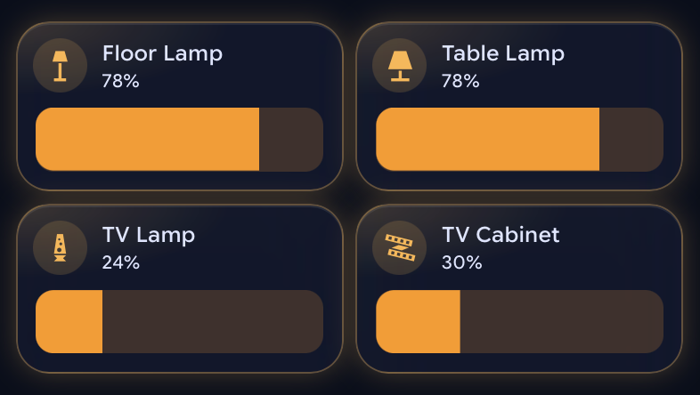
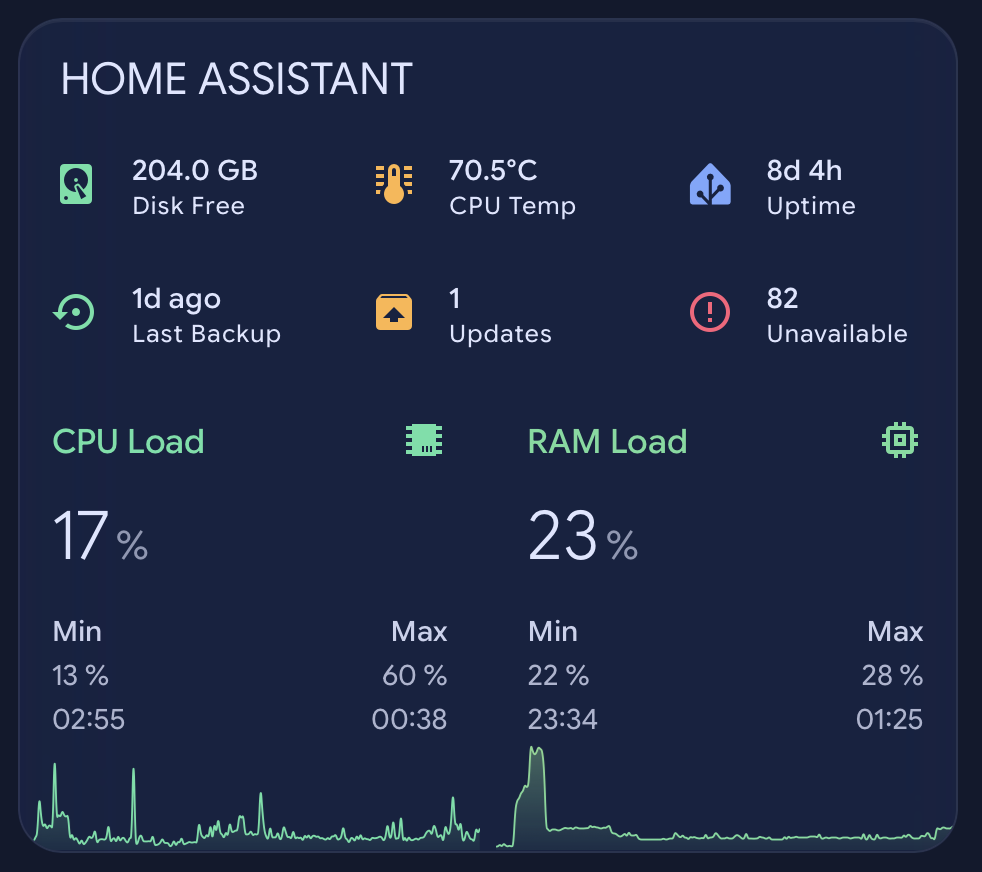
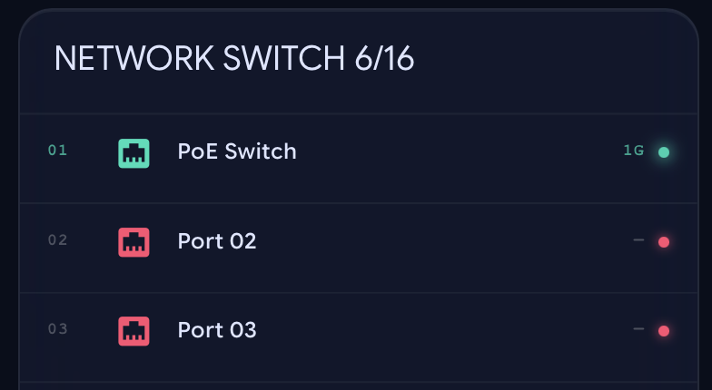
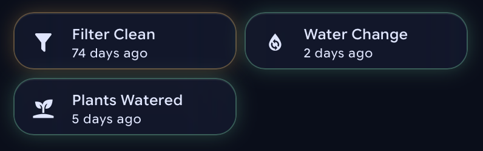
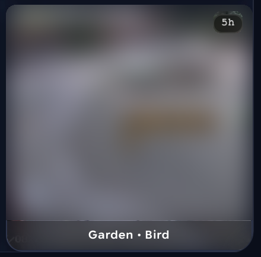

# Glassmorphic Lovelace Cards for Home Assistant

A set of reusable Lovelace dashboard cards built with `card-mod`, `mushroom` and
`streamline-card` — translucent glass surfaces, heavy backdrop blur, per-room accent
colours and state-reactive glows.

Every card is parameterised. Point it at your own entities and it works; there are no
entity IDs from my house baked in, and each card's README lists exactly which values you
need to change.

This is deliberately **not** a config dump — no automations, no floor plan, no entity
registry. Just the parts that are genuinely reusable.

The shared design tokens live in [`theme/`](theme/), which is what keeps the cards looking
like one system rather than eight unrelated boxes.

## The cards

<table>
<tr>
<td width="50%" valign="top">
<a href="cards/room-card/"></a>
<b><a href="cards/room-card/">Room card</a></b><br>
Overview tile per room — climate, light/media/switch chips, occupancy bar. Taps through to that room's view.
</td>
<td width="50%" valign="top">
<a href="cards/room-description/"></a>
<b><a href="cards/room-description/">Room status bar</a></b><br>
Occupancy, time since, and temperature as pills. Built for a view's <code>badges:</code> slot.
</td>
</tr>
<tr>
<td width="50%" valign="top">
<a href="cards/bubble-cards/"></a>
<b><a href="cards/bubble-cards/">Bubble cards</a></b><br>
Light, switch, media player and climate, sharing one glass recipe and variable set.
</td>
<td width="50%" valign="top">
<a href="cards/system-stats/"></a>
<b><a href="cards/system-stats/">System stats</a></b><br>
Host health — disk, CPU temp, uptime, backups, pending updates, unavailable entities, load graphs.
</td>
</tr>
<tr>
<td width="50%" valign="top">
<a href="cards/network-switch/"></a>
<b><a href="cards/network-switch/">Network switch</a></b><br>
One row per port — description, negotiated speed, pulsing link LED, live up-count in the header.
</td>
<td width="50%" valign="top">
<a href="cards/maintenance-tracker/"></a>
<b><a href="cards/maintenance-tracker/">Maintenance tracker</a></b><br>
"Last done / days since" tiles for recurring jobs. Tap to stamp as done; colour shifts as they come due.
</td>
</tr>
<tr>
<td width="50%" valign="top">
<a href="cards/camera-snapshot/"></a>
<b><a href="cards/camera-snapshot/">Camera snapshot</a></b><br>
Detection snapshots with an age badge and a border that reacts to how fresh they are.
</td>
<td width="50%" valign="top">
<b><a href="cards/bambu-printer/">Bambu Lab printer</a></b><br>
SVG progress ring, remaining time, nozzle/bed/layer chips, cover thumbnail, chamber light and pause/resume.
</td>
</tr>
</table>

## Also in here

| Path | What it is |
|---|---|
| [`theme/`](theme/) | Shared design tokens: colours, radii, blur values, glass surface recipe |
| [`templates/`](templates/) | Jinja templates, including an LLM house-state summary prompt |
| [`docs/`](docs/) | Hard-won notes: card_mod limitations, Frigate/go2rtc/Scrypted, Jinja traps |

## Requirements

All installed via [HACS](https://hacs.xyz/):

| Component | Needed for |
|---|---|
| [`card-mod`](https://github.com/thomasloven/lovelace-card-mod) | The glass treatment. Used by every card here. |
| [`streamline-card`](https://github.com/brunosabot/streamline-card) | Card templating — define once, instantiate many |
| [`mushroom`](https://github.com/piitaya/lovelace-mushroom) | Most cards |
| [`button-card`](https://github.com/custom-cards/button-card) | Room card, printer card |
| [`stack-in-card`](https://github.com/custom-cards/stack-in-card) | Network switch, system stats |
| [`mini-graph-card`](https://github.com/kalkih/mini-graph-card) | System stats graphs |

Each card's README lists the specific subset it needs — nothing requires all six.

Note the cards in [`cards/bubble-cards`](cards/bubble-cards/) are named for their shape,
not for the [Bubble Card](https://github.com/Clooos/Bubble-Card) component. They're built
on mushroom, and you don't need Bubble Card installed.

## How to use these

Cards are written as [Streamline](https://github.com/brunosabot/streamline-card) templates
wherever they're repeated. Streamline templates are defined once under
`streamline_templates:` in your dashboard's raw YAML editor, then instantiated with
different variables:

```yaml
streamline_templates:
  room_card:
    card:
      type: custom:button-card
      # ... template body, referring to [[variables]]

views:
  - cards:
      - type: custom:streamline-card
        template: room_card
        variables:
          name: Kitchen
          entity_id_temperature: sensor.kitchen_temperature
          entity_id_lights: light.kitchen_lights
```

Where a card isn't repeated, it's a plain manual card you can paste straight into a view.

Placeholders you need to replace are written in angle brackets — `sensor.<switch>_port_1_status`
— and every card README has a **Replace these** table listing them. A card with no
placeholders says so.

## Licence

MIT — see [LICENSE](LICENSE). Use them, change them, no attribution needed.
