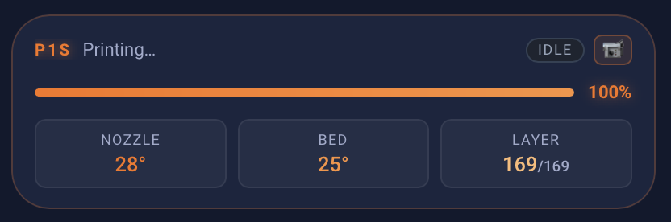

# Bambu Lab printer card

A compact printer status row: model label and current filename, a status pill, a
view-toggle button, a linear progress bar with percentage and time remaining, and
Nozzle / Bed / Layer readouts underneath.



Built for a P1S, but nothing here is model-specific beyond the label — any printer
integration exposing the same entities works with the prefix swapped.

## It hides itself when idle

The card is wrapped in a `conditional` that shows it only when `current_stage` is
something other than `idle`, `finish`, `unknown` or `unavailable`. A printer that isn't
printing takes up no space at all.

Worth knowing before you paste it and conclude it's broken: **on an idle printer you will
see nothing.** Start a print, or temporarily paste the inner `vertical-stack` without the
`conditional` wrapper, if you want to see it while building the view.

## Replace these

| Placeholder | Replace with |
|---|---|
| `<printer>` | Your printer's device prefix |
| `<view_toggle>` | An `input_boolean` helper you create |

ha-bambulab names entities `sensor.<model>_<serial>_<thing>`, so your prefix looks like
`p1s_01p00c590900937` or `x1c_00m09a361800428`. Find it in **Developer Tools → States**.
One find-and-replace covers every entity in the file.

Entities it reads:

| Entity | Used for |
|---|---|
| `sensor.<printer>_print_progress` | Bar fill and the percentage |
| `sensor.<printer>_current_stage` | Status pill, its colours, and whether the card shows at all |
| `sensor.<printer>_current_file` | Filename beside the model label |
| `sensor.<printer>_remaining_time` | Time remaining, right of the percentage |
| `sensor.<printer>_nozzle_temperature` / `_bed_temperature` | Two of the three readouts |
| `sensor.<printer>_current_layer` / `_total_layer_count` | The layer readout |

## The view toggle

Tapping the card flips `input_boolean.<view_toggle>`, and the small button at the top
right changes icon to match — one state for cover art, the other for a live stream.

The card doesn't render either view itself. The helper is a hook: point a companion
picture-entity or camera card at the same boolean with a `conditional`, and one tap
switches between them. If you don't want that, delete the `tap_action` block and the
button `div` from the header and the card still works.

Create the helper via **Settings → Devices & Services → Helpers → Toggle**.

## Requirements

- `card-mod`
- `button-card` — the entire layout is built in its `content` custom field
- A Bambu Lab integration such as [ha-bambulab](https://github.com/greghesp/ha-bambulab)

## Setup

1. Find your device prefix in **Developer Tools → States**.
2. Create an `input_boolean` helper for the view toggle, or remove that part.
3. Find-and-replace `<printer>` and `<view_toggle>` in `compact-card.yaml`.
4. Paste the card into a view.

## How it's built

The card is a `button-card` whose `stats` custom field is a JavaScript template returning
an HTML string. Everything builds from one constant:

```js
const p  = '<printer>';
const s  = (id) => states[`sensor.${p}_${id}`]?.state ?? '';
```

That's an unusual way to build a Lovelace card, and it's a deliberate trade: you get real
layout control and one place to compute everything, at the cost of no Lovelace-level tap
actions inside the rendered markup. The whole card shares a single tap action.

### Remaining time

`sensor.<printer>_remaining_time` comes back as a string like `"1h 24m"`, so the card
regex-matches it rather than treating it as a number. If your integration reports minutes
as an integer, that's the block to rewrite — otherwise the time simply won't appear.

### Stage colours

The status pill takes three treatments: printing is green, paused is amber, anything else
is slate. The orange `#f97316` used for the bar, the percentage and the nozzle readout is
the printer accent and is independent of stage.

These are the card's own colours and don't come from [`theme/`](../../theme/) — see the
drift note there.

## Adapting it

- **Different model** — change the `P1S` string in the header.
- **Always visible** — drop the `conditional` wrapper and paste the inner `vertical-stack`
  directly.
- **Different readouts** — the three tiles are a `grid-template-columns: repeat(3,1fr)`
  block near the bottom of the field. A fourth means changing that to `repeat(4,1fr)`;
  past four they get cramped at typical column widths.
