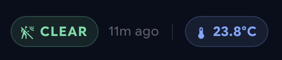

# Room status bar

A compact row of pills for a single room: occupancy, how long since it last changed, and
the current temperature.




It's the companion to [`room-card`](../room-card/). That tile is the room seen from the
overview; this is the header of the room's own view once you've tapped through.

## Put it in `badges:`, not in a grid

This is the part that isn't obvious. The card draws no background, no border and no
padding, because it's built for a sections view's `badges:` slot — the row beside the view
title:

```yaml
views:
  - type: sections
    header:
      card:
        type: custom:streamline-card
        template: room_title_card
        variables:
          title: <Room>
    badges:
      - type: custom:streamline-card
        template: room_description_card
        variables:
          room_temperature_sensor: sensor.<room>_temperature
          room_motion_sensor: binary_sensor.<room>_motion
    sections:
      - type: grid
        cards: []
```

Drop it into a grid instead and it'll render as a floating row of pills with nothing
behind them. That's not a bug — put it inside a container that supplies its own surface if
you want it in the body of a view.

## Replace these

Nothing in the template body, with one value to check.

| Placeholder | Where | Replace with |
|---|---|---|
| `weather.forecast_home` | `status_bar` field | Your weather entity, **if yours differs** |

It's read only for the temperature unit, and falls back to `°C` when the entity is
missing — so a wrong value here degrades quietly rather than breaking the card. Worth
correcting anyway if you're on °F.

## Variables

| Variable | Does |
|---|---|
| `room_temperature_sensor` | Temperature for the blue pill |
| `room_motion_sensor` | Motion or presence sensor; optional |

**Leave the motion sensor out and the occupancy pill and timestamp aren't drawn** — you
get just the temperature pill, correctly spaced. Useful for rooms with a thermometer but
no presence detection.

Both are declared with entity `selector:` blocks:

```yaml
variables:
  - name: room_temperature_sensor
    selector:
      entity:
        domain: sensor
```

That's what makes Streamline's visual editor offer a filtered entity picker rather than a
free-text box. If you add variables of your own, it's worth copying the pattern — it costs
four lines and removes a whole class of typo.

## Requirements

- `button-card`
- `streamline-card`

## Setup

1. Paste `room-description-card.yaml` under `streamline_templates:` in your dashboard's
   raw configuration editor.
2. Add it to the `badges:` list of each room view.

## States

| Occupancy | Colour | Icon |
|---|---|---|
| Motion on | Red `#FF5E7A` | `mdi:motion-sensor` |
| Motion off | Green `#5BE1A6` | `mdi:motion-sensor-off` |

The temperature pill is always blue `#7AA7FF`, and shows an em dash when the sensor is
unavailable rather than `NaN`.

The relative timestamp comes from the motion sensor's `last_updated`, so it reads "how
long in this state" — 40 minutes of `Clear` means 40 minutes since anyone was detected.
Note that `last_updated` also moves on attribute changes, so a chatty sensor can reset it
without the state having changed; use `last_changed` in the `status_bar` field if that
bothers you.

## Adapting it

- **Pill wording** — `Occupied` / `Clear` are in the `status_bar` field.
- **Adding a humidity pill** — copy the temperature pill block and change the entity and
  icon. The row is a flex container, so it'll space itself.
- **Thresholds on temperature** — there are none; the pill is always blue. If you want it
  to react, the colour is hardcoded in two places in that block.
